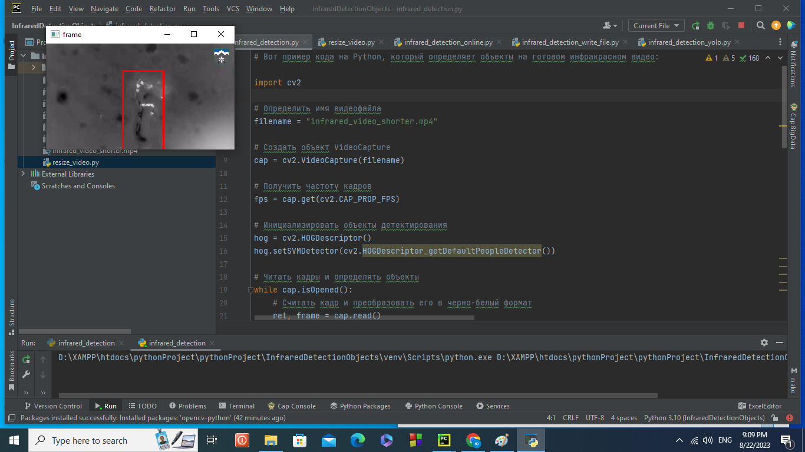
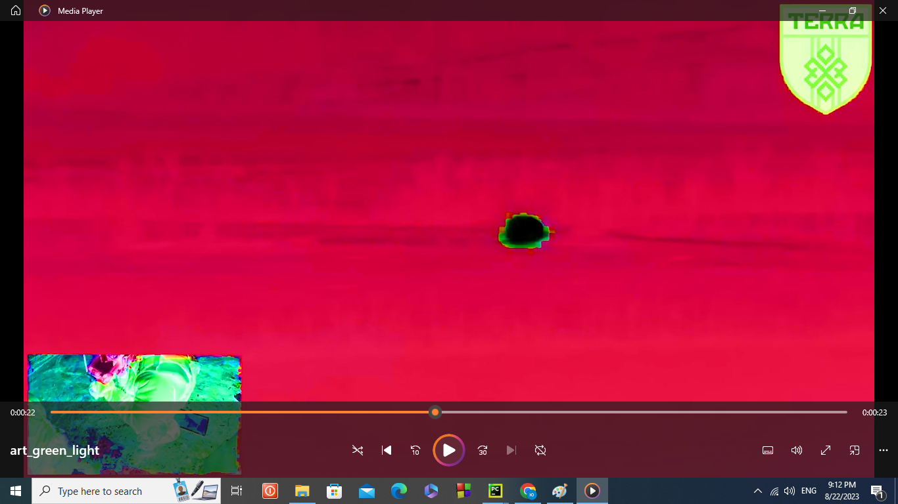

# infrared_detection_objects
here are differents files and ampties for infrared detection from drons and another infrared ways

Detected soldiers in reduts after 4-time squizee video
For squizee fotos and videos and open threads cand find help there: https://github.com/yuriystupak2020/AugmentationInfrared1

Before art filters:

After art filters:

